# Pokémon Red, Green, and Blue JP: Masaru2 Edition

**pokejp** serves as a dissassembly base, based on the Japanese releases of the Generation 1 Pokémon games.
Improves the romhack made by the user MoriyaFaith and fixes various things that weren't in his romhack.

It builds the following ROMs:

* Pokered.gb 
* Pokegreen.gb  
* Pokeblue.gb

As well as these:
 
* Pokered_debug.gb
* Pokegreen_debug.gb
* Pokeblue_debug.gb 

## Downloading and playing
Download the patches from the [Release](https://github.com/Masaru2/pokejp/releases) page, there will be two Zip files: **main.zip** are the normal patches, **debug.zip** are the debug patches.

## How do I patch the rom and what roms should I use?

Use a tool like [Lunar IPS](http://fusoya.eludevisibility.org/lips/) (for Windows), [Rompatcher.js](https://www.marcrobledo.com/RomPatcher.js/), [MultiPatch](http://projects.sappharad.com/tools/multipatch.html) (for OS X), or [UniPatcher](https://play.google.com/store/apps/details?id=org.emunix.unipatcher&hl=en) (for Android) to apply the patch 

These are the roms you should use for each version:

**Red**
- Pokemon Red (UE) [S][!].gb `sha1: ea9bcae617fdf159b045185467ae58b2e4a48b9a`

**Green and Blue**
- Pokemon Blue (UE) [S][!].gb `sha1: d7037c83e1ae5b39bde3c30787637ba1d4c48ce2`

They're based off of the ones made by the [pokered](https://github.com/pret/pokered) project.

## Setting up your own

To set up the repository for your own editing purposes, see [**INSTALL.md**](INSTALL.md).

## Why make this?

In 1996, The original Pocket Monsters Red and Green were released. Later that Year, Pocket Monsters Blue was released as well. In the west, 2 years later, Pokémon Red and Blue were released, using the updated Pocket Monsters Blue as the base engine. A Pokémon game with Pocket Monsters Blue's wild data was never released in Japan. This caused a multitude of changes in the International releases of Red and Blue. This ROM hack serves to create English Versions of those Japanese releases, the closest as possible.

## What's changed?

* Any bugs present in the original Red and Green that are not in International Red and Blue are not present and viceversa.
* The Title Screen of Pokemon Red and Green has been changed to the original Japanese release.
* R/G Title Screen scrolling and SFX has been restored (Partially).
* Pokémon Blue's wild Pokémon data has been edited to the Japanese release. Pokémon Green uses US Blue's wild data.
* Pokémon Red and Green now use the original Cerulean Cave layout.
* Pokémon Red and Green use their Overworld and Pokémon graphics from their original release.
* Pokémon Green loads its unique Super Game Boy Palette.
* Each game's Super Game Boy Border now has text saying "POKEMON!" where "POCKET MONSTERS!" normally is in the Japanese version.
* Fixed Glitch where Haunters from in-game trades wouldn't evolve.
* Fixed The "Presents" Under the Game Freak logo not appearing where its supposed to.
* Restores the original flashing lights for the moves "Thunderbolt" and "Hyper Beam".
* Original map border layout from the japanese version restored.
* Translated Red and Green Pokédex entries.(Ported from FRLG)
* Various censored text restored, relocalized or ported directly from FRLG
* The Gym Leader names in the Trainer Card restored.
* The original monetary symbol (円) restored.
* Battle layout restored to its japanese form.
* Small Easter Eggs between versions.

## Screenshots

**Pokémon Red**

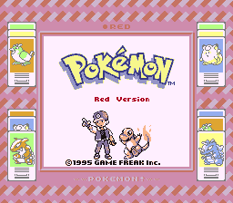
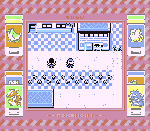
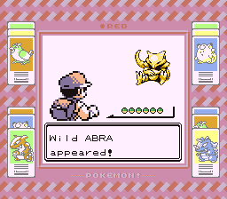
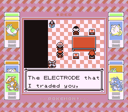
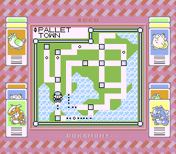

**Pokémon Green**

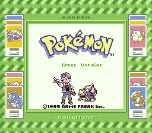
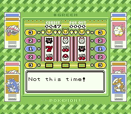
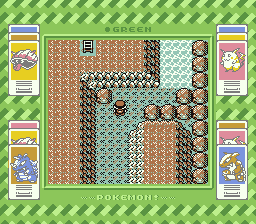
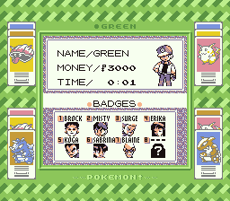
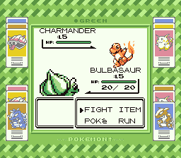

**Pokémon Blue**

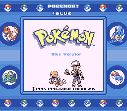
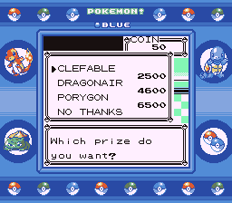
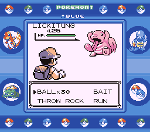
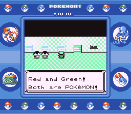

## To-do
* Fix MissingNo. not having the correct graphics, if possible. This could potentially also fix MissingNo. corrupting Hall of Fame data.

## Credits

* MoriyaFaith for his original pokejp project
* [pokered](https://github.com/pret/pokered) for serving as a base dissassembly
* Alchav's fork of pokered, which allowed usage of the RG sprites
* Rangi42 for creating Tilemap Studio and Polished Map, allowing for editing of tilemaps, Cerulean Cave and the Japanese Map Border Layout
* Satomew for fixing the 2x2 tile glitch
* PPG6/Jojobear13 with helping me with port and translate the R/G and FR pokédex descriptions
* Jojobear13 for the trainer card restoration code and the R/G Shooting Star SFX code
* Luckytyploshion for his [pokered-jp](https://github.com/luckytyphlosion/pokered-jp) repository
* Pret and marklincadet for their suggestions